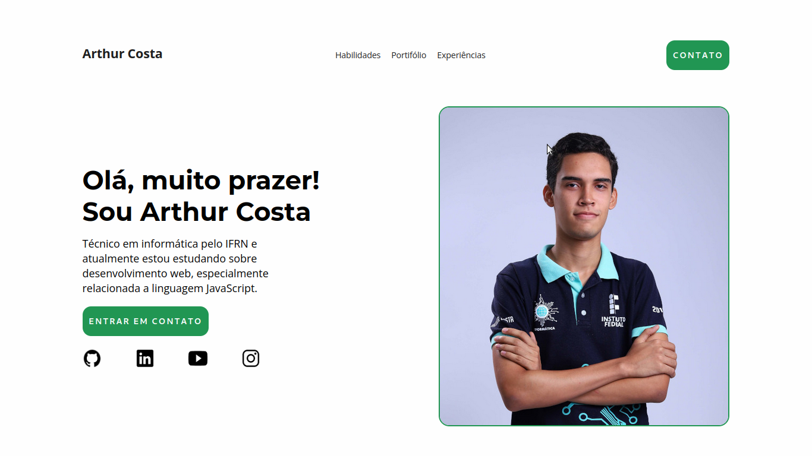

# Introduction

This is project to start studies about HTML, CSS and JS.
The main goal is create a website with my professional information.

## Preview



## Main concepts applied

- Flexbox
- DOM Manipulation
- Events
- CSS Media Queries

## Instructions to run:

1. Clone the project:

```
git clone https://github.com/arthurcostaa/site-portifolio.git
```

2. After clone open the folder:

```
cd site-portifolio
```

3. Open the index file with the browser:

```
index.html
```
